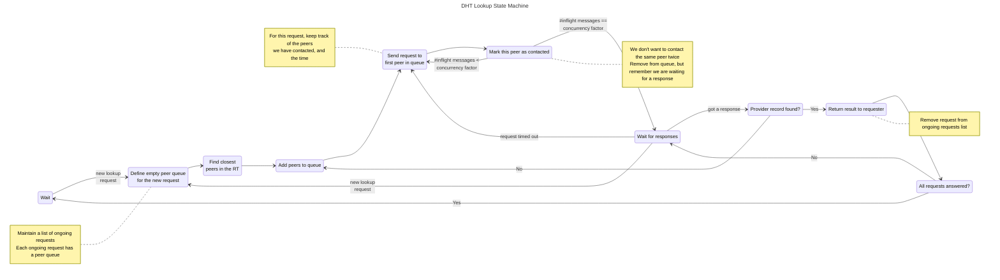

# DHT Modules

Major modules of the DHT. Additional modules can be added.

I.e `fullrt` only has a different `Routing Table` implementation (allowing to bypass some `Routing`).

## DHT Modules

### Provider Store

`Provider Store` is responsible for storing and serving provider records, either pinned locally or remotely. It defines a specific `Provider Record` format. The design of the `Provider Store` database is left to the module implementer.

### Provider

`Provider` is responsible for providing and reproviding content pinned through its interface (`StartProvide` and `StopProvide`). It writes pinned content to the `Provider Store`, and makes use of `Routing` to find the appropriate peers to allocate the provider records.

### Routing Table

`Routing Table` is a database of peer identities and multiaddresses. It must expose at least a `LocalClosestPeers` function returning the closest peers in XOR distance to a provided key. `Routing Table` is responsible for deciding how many peers, and which peers are recorded.

### Routing

`Routing` is a large module, responsible for finding remote peers or values in the network. It needs `Routing Table` to keep track about the identity and multiaddresses of remote peers. `Routing` performs the iterative DHT query process.

### Server

`Server` is responsible for handling incoming requests. For `Put` and `Get` requests it must write to and read from the `Provider Store`. For `FindClosestPeers` requests, it needs the `Routing Table`'s `LocalClosestPeers` function. Actions in `Server` are usually triggered by the `Routing` modules from another peer across the network.

### Network

Use proto3 instead of custom data format.
Use r := pbio.NewDelimitedReader(s, signedIDSize), as reader and similar writer.
Use sync.Pool to avoid too much allocations.

## DHT Interface

For now, the only required interface is a `StartProvide`, `StopProvide`, `ProvideList`, `FindProvs`, `FindPeer`. For IPNS, a `GetValue` will be required.

# [Mutlitier Architecture](https://en.wikipedia.org/wiki/Multitier_architecture)

Each module should follow the three-tier architecture. The Presentation Tier contains the interfaces (high level abstractions). The Presentation Tier of each module is assumed to be the unique source of truth to what the module should be doing. The Application Tier contains the actual implementations. There can be multiple implementations for each module, they can either live in the same folder, or in another repository.

A Data Tier may be required in the future for specific modules.

## DHT Lookup state machine

The goal is for the implementation to be single threaded. The most challenging part is request concurrency, in the Routing Module. The DHT Lookup process state machine can be described as follow:

