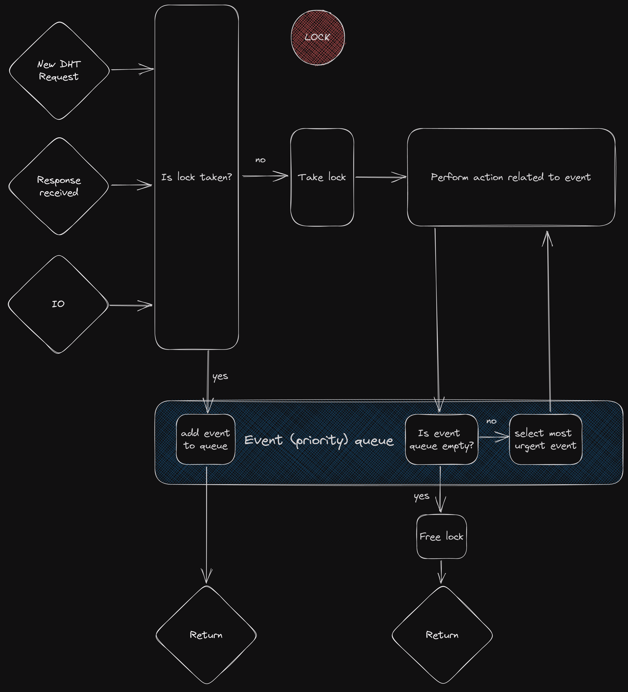

# Single Threaded Kademlia Design

Author: [Guillaume Michel](https://github.com/guillaumemichel)

## DHT Interface

### Peer Routing

- `FindPeers(PeerIDs)`
- (`GetClosestPeers(key)`)

### Provider Records

**Provide**
- `StartProvide(CIDs)`
- `StopProvide(CIDs)`
- `ListProvide()`

**Lookup**
- `FindProvidersAsync(CID)`
- `FindProviders(CID)`

### IPNS

- `PutValues(keys, values)`
- `GetValues(keys)`

### Others

- (`GetPublicKey(PeerID)` ??)

## State Machines

### Single Thread Non Blocking High Level State Machine

### First attempt at DHT Lookup State Machine

```mermaid
---
title: DHT Lookup State Machine
---
stateDiagram-v2
    direction LR
    
    Wait
    
    %% new lookup request
    DefineQueue: Define empty peer queue</br>for the new request
    FindClosestInRT: Find closest</br>peers in the RT
    AddPeersToQueue: Add peers to queue
    SendRequest: Send request to</br>first peer in queue
    MarkPeerContacted: Mark this peer as contacted

    WaitForResponses: Wait for responses
    ProviderRecordFound: Provider record found?

    ReturnResult: Return result to requester
    AllRequestsAnswered: All requests answered?

    Wait --> DefineQueue: new lookup</br>request
    DefineQueue --> FindClosestInRT
    FindClosestInRT --> AddPeersToQueue
    AddPeersToQueue --> SendRequest
    SendRequest --> MarkPeerContacted
    MarkPeerContacted --> SendRequest: #inflight messages <</br>concurrency factor
    MarkPeerContacted --> WaitForResponses: #inflight messages ==</br>concurrency factor
    WaitForResponses --> ProviderRecordFound: got a response
    WaitForResponses --> DefineQueue: new lookup</br>request
    WaitForResponses --> SendRequest: request timed out
    ProviderRecordFound --> AddPeersToQueue: No
    ProviderRecordFound --> ReturnResult: Yes
    ReturnResult --> AllRequestsAnswered
    AllRequestsAnswered --> Wait: Yes
    AllRequestsAnswered --> WaitForResponses: No

    note left of DefineQueue
        Maintain a list of ongoing requests
        Each ongoing request has a peer queue
    end note

    note left of SendRequest
        For this request, keep track of the peers
        we have contacted, and the time
    end note

    note right of MarkPeerContacted
        We don't want to contact the same peer twice
        Remove from queue, but remember we are waiting for a response
    end note

    note right of ReturnResult
        Remove request from ongoing requests list
    end note
```

## Modules

Major modules of the DHT. Additional modules can be added.

```mermaid
---
title: DHT Modules
---
flowchart TD
    K["<font size=5><b>Kubo</b></font>"] --> P["<font size=5><b>Provider</b></font><br>StartProvide()<br>StopProvide()<br>ProvideList()"]
    K --> PS["<font size=5><b>Provider Store</b></font><br>Provider Records<br>Database<br>Cache (LRU)"]
    P --> PS
    P --> R
    K --> R["<font size=5><b>Routing</b></font><br>FindClosestPeers()<br>GetValue()<br>FindPeer()"]
    S["<font size=5><b>Server</b></font><br>Put()<br>Get()<br>FindClosestPeers()"] --> PS
    R -.->|over network| S
    S --> RT["<font size=5><b>Routing Table</b></font><br>LocalClosestPeers()"]
    R --> RT
```

I.e `fullrt` only has a different `Routing Table` implementation (allowing to bypass some `Routing`).

### Provider Store

`Provider Store` is responsible for storing and serving provider records, either pinned locally or remotely. It defines a specific `Provider Record` format. The design of the `Provider Store` database is left to the module implementer.

**Interface**

Above:
- `PUT(key, value)`
- `GET(key) value`

Below:
- Database scheme?

### Provider

`Provider` is responsible for providing and reproviding content pinned through its interface (`StartProvide` and `StopProvide`). It writes pinned content to the `Provider Store`, and makes use of `Routing` to find the appropriate peers to allocate the provider records.

**Interface**

Above:
- `StartProviding([]cid.Cid)`
- `StopProviding([]cid.Cid)`
- `ListProviding() []cid.Cid`

Below:
- Provider Store (to store pinned CIDs, and access the reprovide list)
- Routing (to advertise pinned CIDs)

### Routing Table

`Routing Table` is a database of peer identities and multiaddresses. It must expose at least a `LocalClosestPeers` function returning the closest peers in XOR distance to a provided key. `Routing Table` is responsible for deciding how many peers, and which peers are recorded.

**Interface**

Above:
- `TryAddPeer(peer.AddrInfo) bool` try to add a peer in the routing table
- `RemovePeer(peer.id) bool` remove a peer from the routing table
- `GetClosestPeers(KadId, n) []peer.id` finds the `n` closest peers from the Routing Table (local)

Below:
- add peers to libp2p peerstore (with specific TTL, and keep peers in peerstore even tough we may not be connected anymore)
- remove peers from libp2p peerstore

Note: need to check whether these operations are blocking.
### Routing

`Routing` is a large module, responsible for finding remote peers or values in the network. It needs `Routing Table` to keep track about the identity and multiaddresses of remote peers. `Routing` performs the iterative DHT query process.

**Interface**

Above:
- `FindClosestPeers(KadId, n) []peer.id` finds the `n` closest peers globally
- `FindProviders(KadId)` lookup stops once a matching provider record is found
- `FindValue(KadId)` essentially the same as `FindProviders(KadId)`

Below:
- Routing Table
- Server

### Server

`Server` is responsible for handling incoming requests. For `Put` and `Get` requests it must write to and read from the `Provider Store`. For `FindClosestPeers` requests, it needs the `Routing Table`'s `LocalClosestPeers` function. Actions in `Server` are usually triggered by the `Routing` modules from another peer across the network.

**Interface**

Above (remote nodes requests):
- `Put/Provide(KadId, val)`
- `Get/GetProviders(KadId)`
- `FindClosestPeers(KadId)`

Below:
- Routing Table (`GetClosestPeers(KadId, n)`)
- Provider Store (for content PUT/GET requests)

### Network

Use proto3 instead of custom data format.
Use r := pbio.NewDelimitedReader(s, signedIDSize), as reader and similar writer.
Use sync.Pool to avoid too much allocations.
